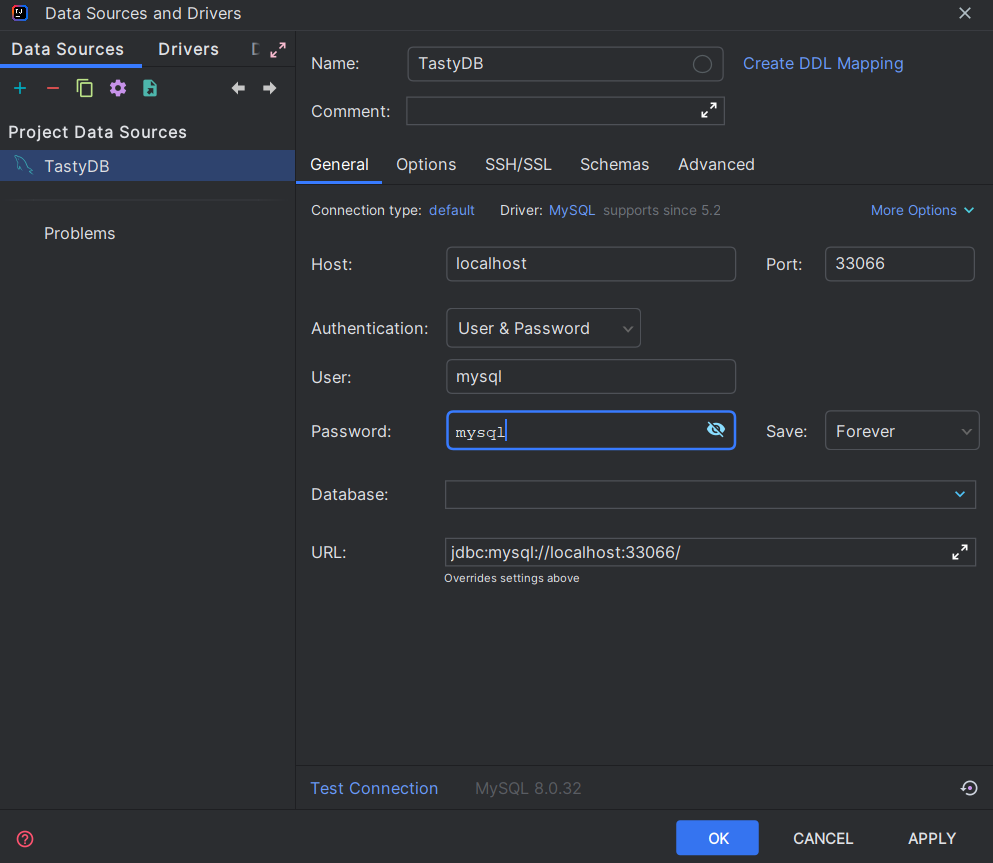

# Ze smakiem

## Description

This is a simple student project.

It's goal is to create a cooking blog that will provide its users with the ability to post recipes, posts, thoughts on
dishes, as well as comment on other users' posts. Each user will also have the ability to add posts/recipes to
favorites, as well as view them on their profile.

## Visuals

!!! To be updated later

## Installation

Application requirements:

- JDK 17
- Angular 14

Setting up (clean) database:

Move on to directory main directory and run the following:

``
docker-compose up
``

alternatively you can open docker-compose file and run the script manually. This will download necessary dependencies
and run docker container with database. The next thing is to run main Application. This will start the app, and create
database with its tables along with some mock data.

Credentials for connecting to database (via IntelliJ Idea):

## Usage

Business requirements:

- View blog posts
- Share recipes, posts
- Adding posts to favorites
- Viewing favorite posts
- Logging in as a reader
- Commenting on posts as a reader
- Viewing a user's profile
- Edit a user's profile

## Authors and acknowledgment

* Rafał Zan
* Piotr Sioch
* Mikołaj Bańkowski

## Project status

Currently, in development
